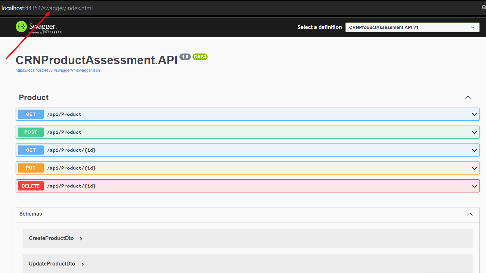
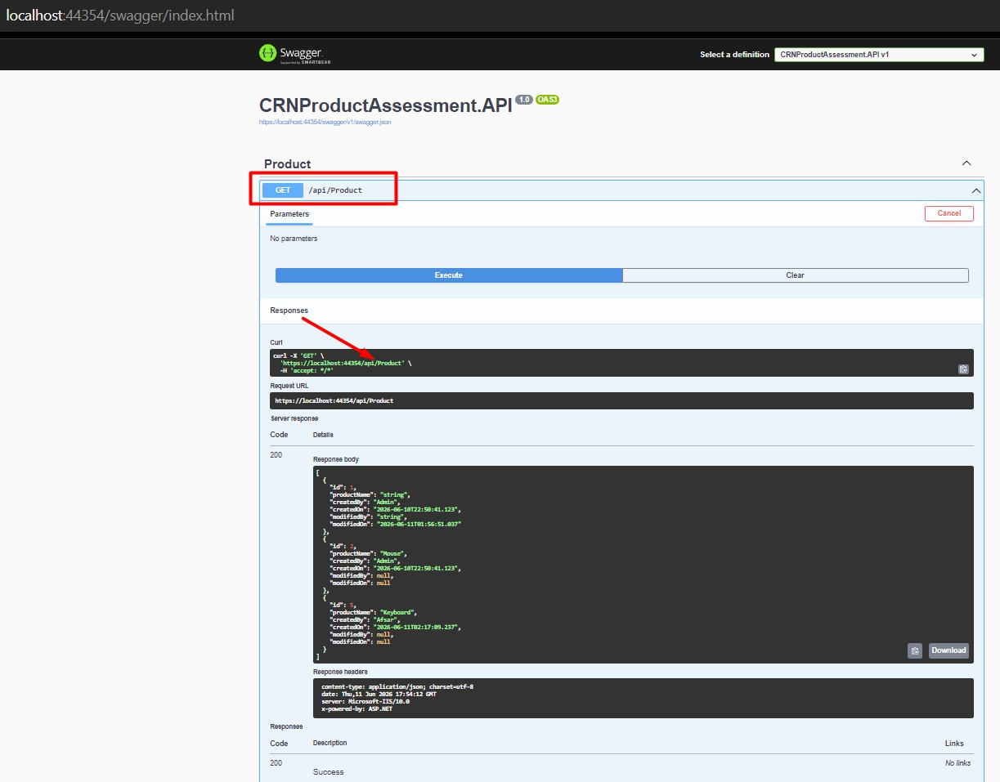
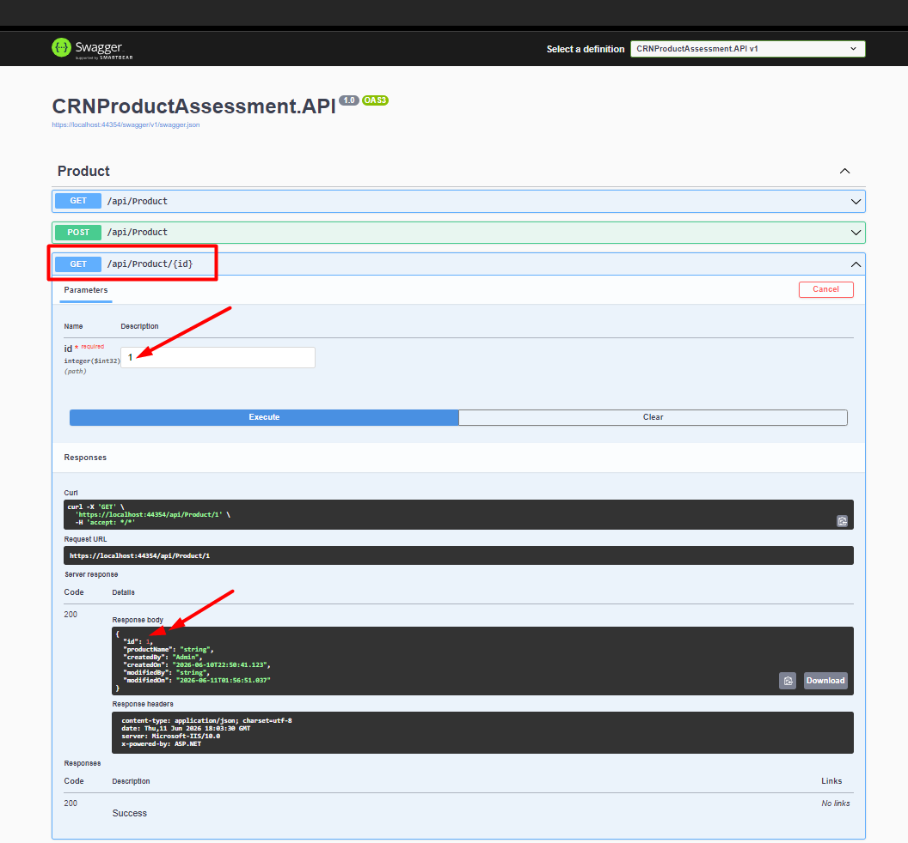
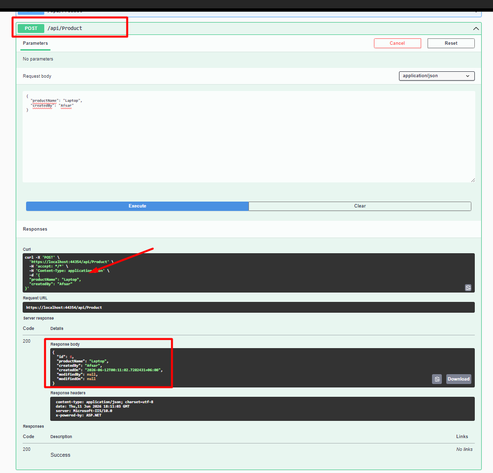
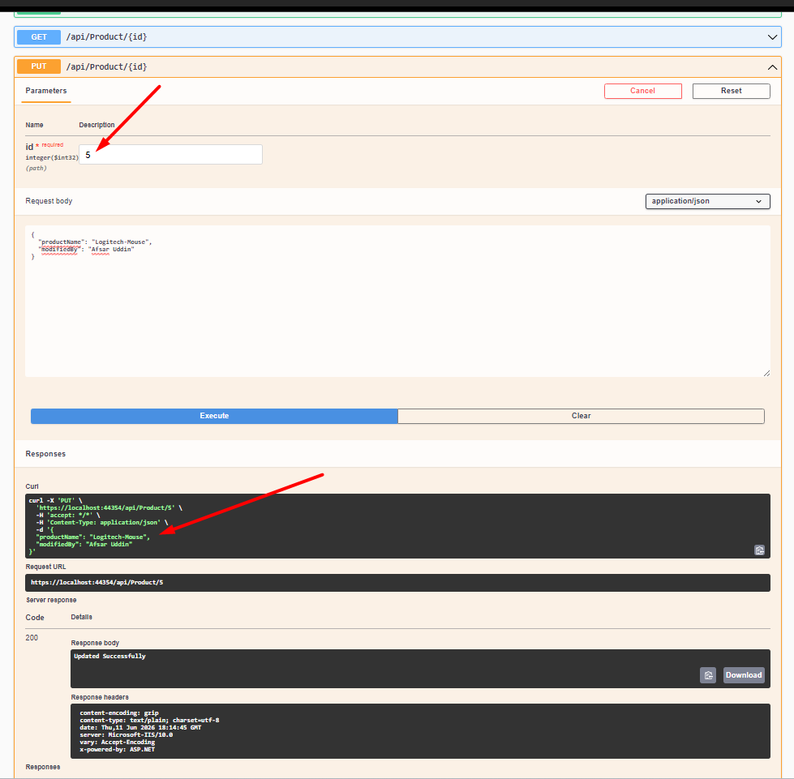
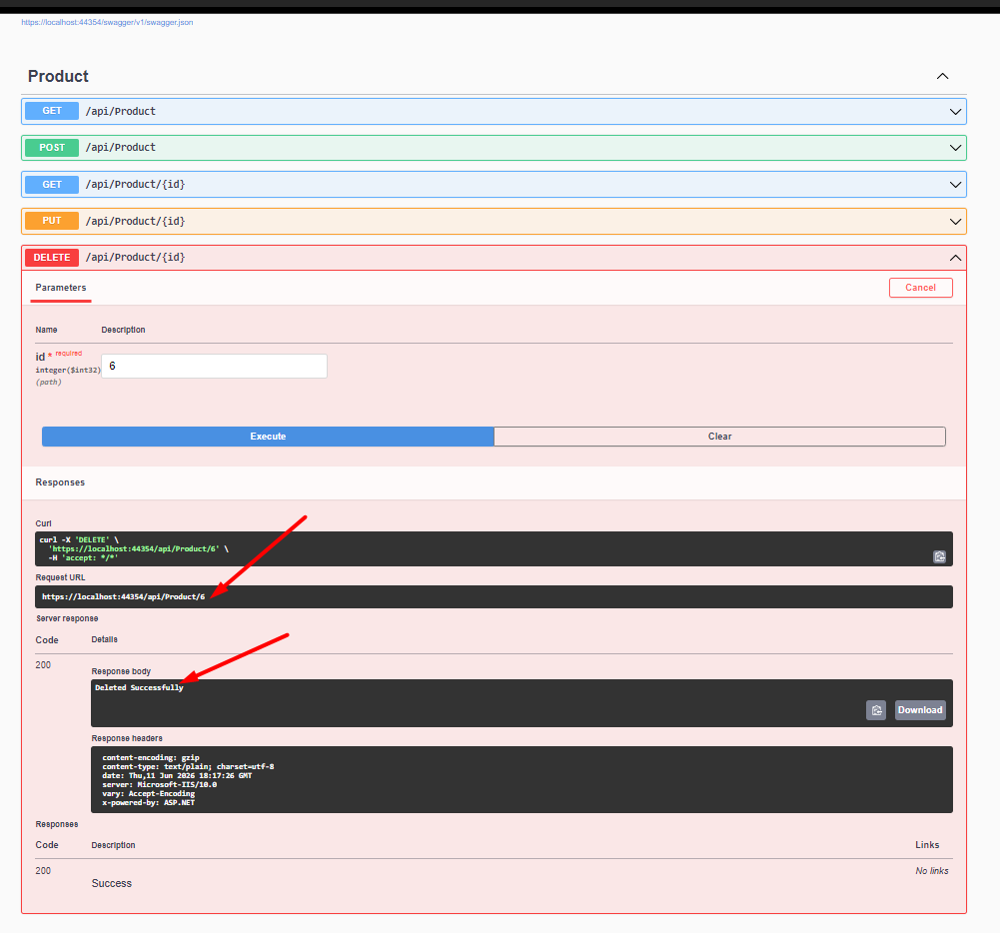
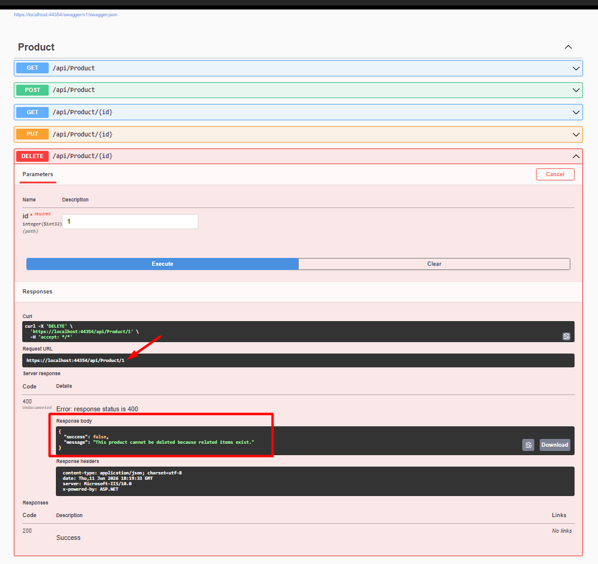

\# CRN Product Assessment API


ASP.NET Core 8 Web API technical assessment project for Product CRUD operations using Clean Architecture, Entity Framework Core, SQL Server, Repository Pattern, DTO, FluentValidation, and Global Exception Middleware.


\## Technologies Used


\* ASP.NET Core 8 Web API

\* C#

\* Entity Framework Core 8

\* SQL Server

\* Swagger / OpenAPI

\* Repository Pattern

\* Service Layer

\* DTO Pattern

\* FluentValidation

\* Global Exception Middleware

\* Dependency Injection


\## Project Architecture


The solution follows a layered architecture:


API Layer

↓

Application Layer

↓

Infrastructure Layer

↓

Domain Layer


\## Project Structure


CRNProductAssessment.API

CRNProductAssessment.Application

CRNProductAssessment.Domain

CRNProductAssessment.Infrastructure


\## Features


\* Create Product

\* Get All Products

\* Get Product By Id

\* Update Product

\* Delete Product

\* DTO-based request/response handling

\* FluentValidation for input validation

\* Global Exception Middleware

\* Repository Pattern

\* Service Layer

\* SQL Server database integration

\* Swagger API documentation

\* Prevent product deletion when related items exist


\## API Endpoints


GET /api/Product

GET /api/Product/{id}

POST /api/Product

PUT /api/Product/{id}

DELETE /api/Product/{id}


\## Business Rule


A product cannot be deleted if related items exist.


Example response:


```json

{

&#x20; "success": false,

&#x20; "message": "This product cannot be deleted because related items exist."

}

```


\## Database Tables


Product


\* Id

\* ProductName

\* CreatedBy

\* CreatedOn

\* ModifiedBy

\* ModifiedOn


Item


\* Id

\* ProductId

\* Quantity


\## How to Run


1\. Clone the repository.

2\. Open the solution in Visual Studio 2022.

3\. Update the SQL Server connection string in `appsettings.json`.

4\. Restore NuGet packages.

5\. Run the SQL database script if required.

6\. Run the API project.

7\. Open Swagger URL:


```text

https://localhost:44354/swagger

```


## Screenshots

### Swagger Home


### Get All Products


### Get Product By Id


### Create Product


### Update Product


### Delete Product


### Delete Restriction Validation



